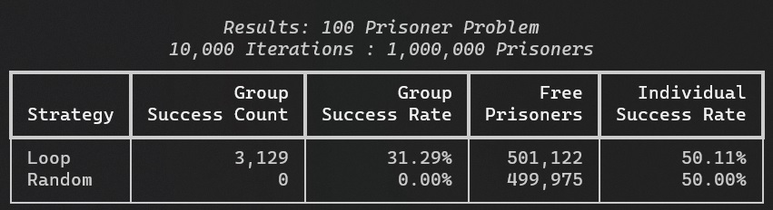
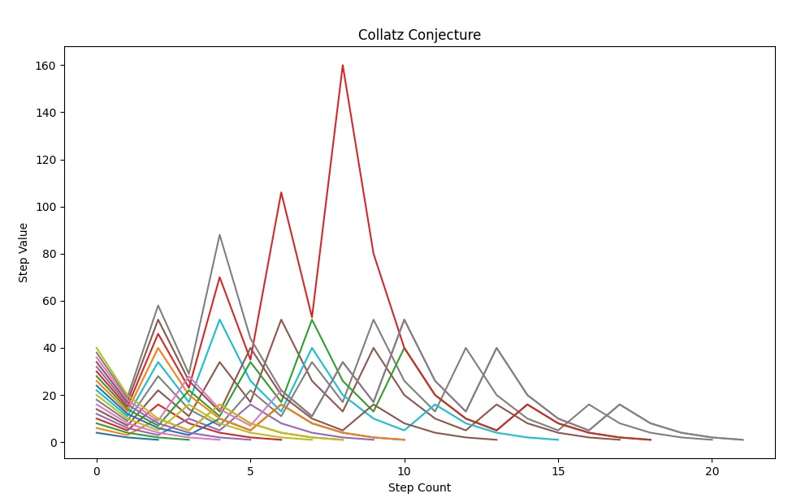

# Py-Problems

A collection of riddles, games, and problems modeled using python.

## [Soduko Solver](./projects/soduko_solver/)

Solves soduko puzzles using recursion.

## [100 Prisoner Problem](./projects//prisoner_problem/)

Each of 100 prisoner has to find their own number in one of 100 drawers, but may open only 50 of the drawers. 
This program tests probabilities for different strategies to solve the [100 Prisoner Problem](https://en.wikipedia.org/wiki/100_prisoners_problem).

## [Collatz Conjecture (3n + 1 problem)](./projects/collatz_conjecture/)

Given a set of integers, this program calculates the sequence of numbers (steps) for each integer following the rules of [Collatz Conjecture](https://en.wikipedia.org/wiki/Collatz_conjecture):

* If the previous term is even, the next term is one half of the previous term (*n / 2*).
* If the previous term is odd, the next term is 3 times the previous term plus 1 (*3n + 1*).

The results are displayed on a graph.

